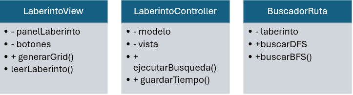
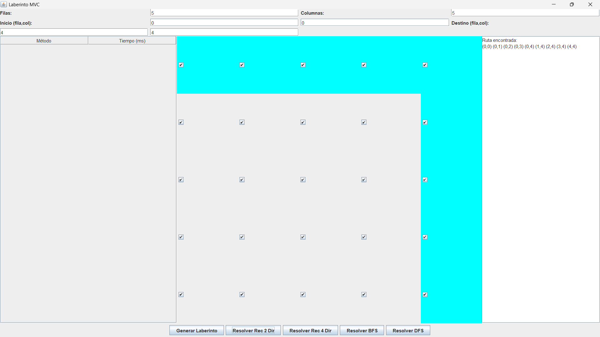
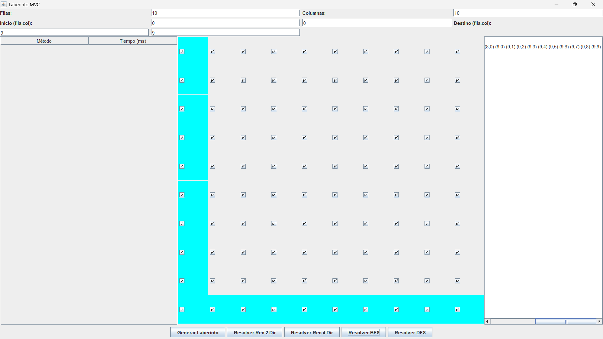
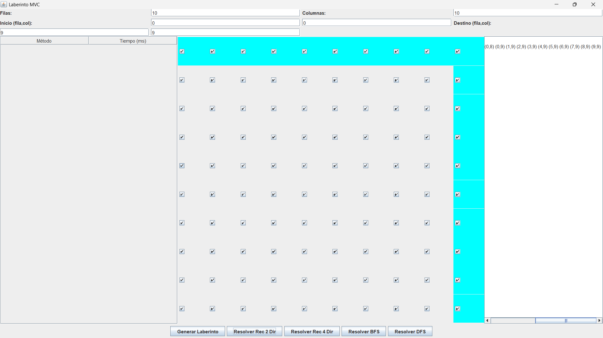

* Proyecto Laberinto MVC *
-- Descripción del problema --
El objetivo de este proyecto es desarrollar una aplicación que permita crear y resolver laberintos mediante diferentes algoritmos de búsqueda y recorrido. El usuario puede definir el tamaño del laberinto, seleccionar las celdas transitables o no transitables, establecer puntos de inicio y destino, y elegir entre distintos algoritmos para encontrar una ruta óptima entre esos puntos. 
-- Propuesta de solución --
* Marco teórico *
DFS (Depth-First Search):
Algoritmo de búsqueda que explora tanto como sea posible por cada rama antes de retroceder (backtracking). Es recursivo o puede usarse con pila. Puede no ser óptimo para encontrar la ruta más corta, pero es simple y eficiente en memoria.

* BFS (Breadth-First Search): *
Explora los nodos vecinos en niveles. Usa una cola. Siempre encuentra la ruta más corta en grafos no ponderados, ideal para laberintos.

* Backtracking: *
Técnica de prueba y error para construir soluciones paso a paso y descartar las que no cumplen. DFS es un tipo común de backtracking.

Recursión:
Técnica para resolver problemas dividiéndolos en subproblemas idénticos pero más pequeños. DFS es típicamente recursivo.

-- Tecnologías utilizadas -- 
Java: Lenguaje de programación principal.

Swing: Para la interfaz gráfica de usuario.

MVC (Modelo-Vista-Controlador): Arquitectura para separar lógica de negocio, interfaz y control.

Explicación:

LaberintoView gestiona la interfaz gráfica, captura inputs y muestra resultados.

LaberintoController conecta la vista con el modelo y la lógica, maneja eventos y ejecuta búsquedas.

BuscadorRuta implementa los algoritmos para encontrar rutas en el laberinto.
* Laberinto 5X5 y metodo de recursividad 2 

* Laberinto 10x10 y metodo de BFS

* Laberinto 10x10 y metodo de recursividad 2 

 
 -- Ejemplo de codigo -- 
public Ruta buscarDFS() {
    // Obtiene el número de filas y columnas del laberinto
    int filas = laberinto.getFilas();
    int columnas = laberinto.getColumnas();

    // Crea una matriz para marcar qué celdas ya fueron visitadas y evitar ciclos
    boolean[][] visitado = new boolean[filas][columnas];

    // Lista para almacenar el camino (ruta) desde el inicio hasta el destino si se encuentra
    List<Punto> ruta = new ArrayList<>();

    // Llama a la función recursiva que realiza la búsqueda en profundidad desde el punto inicial
    // Si la búsqueda tiene éxito, retorna la ruta encontrada
    if(buscarDFSRec(laberinto.getInicio(), visitado, ruta)) {
        return new Ruta(ruta);
    }

    // Si no se encontró ruta, retorna null
    return null;
}

La función recursiva buscarDFSRec hace el trabajo real de recorrer el laberinto, y si encuentra el destino, el método retorna la ruta encontrada. Si no, retorna null.
* Conclusiones
Después de implementar y probar los algoritmos, se concluye que:

BFS es el más óptimo para encontrar la ruta más corta en laberintos sin ponderar, debido a su búsqueda por niveles y garantía de la menor cantidad de pasos.

DFS y Backtracking son útiles para explorar todas las posibles rutas o para problemas donde se requiere profundidad máxima, pero no garantizan rutas óptimas.

Los algoritmos recursivos son intuitivos y fáciles de implementar, aunque para laberintos grandes pueden ser ineficientes en memoria.

* Recomendaciones y aplicaciones futuras
Implementar algoritmos heurísticos como A* para mejorar la eficiencia en laberintos grandes.

Añadir visualización en tiempo real del proceso de búsqueda.

Optimizar la interfaz para dispositivos móviles o web.